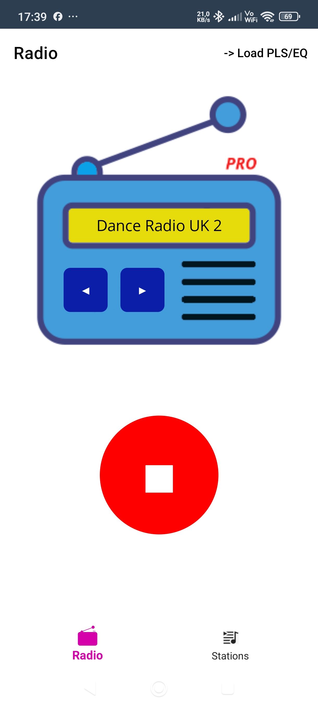
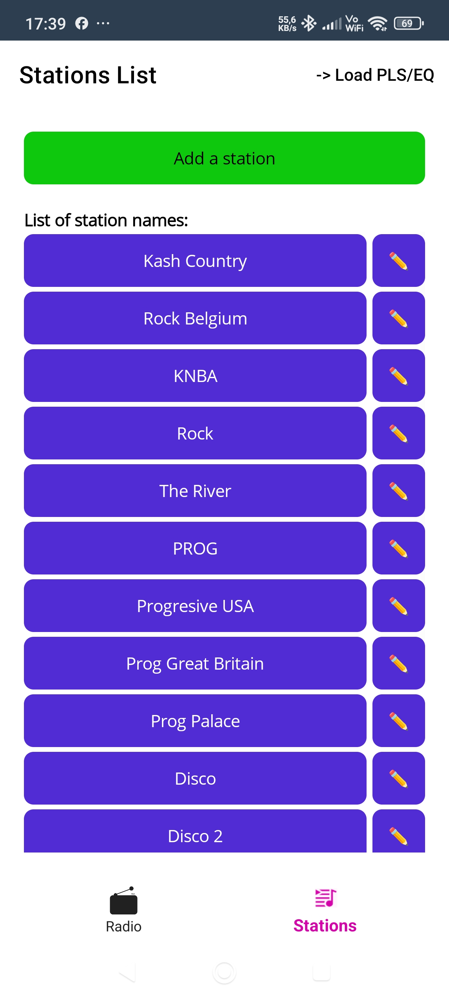
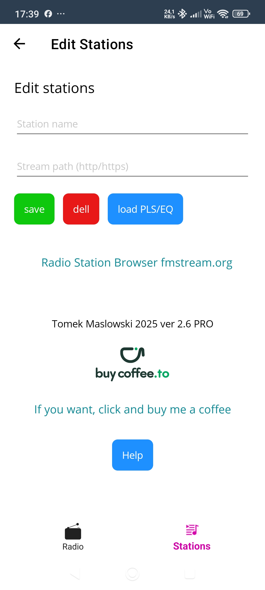
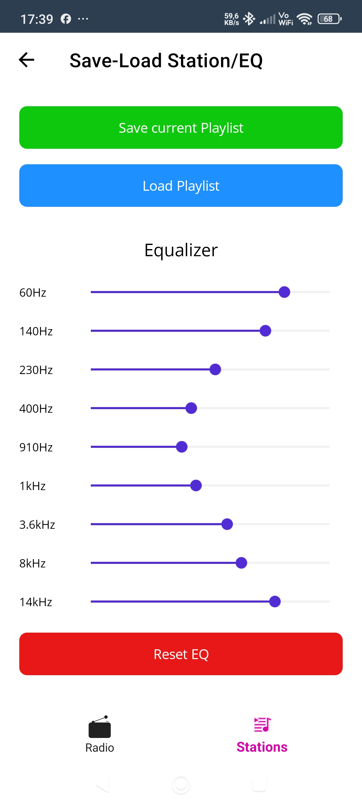
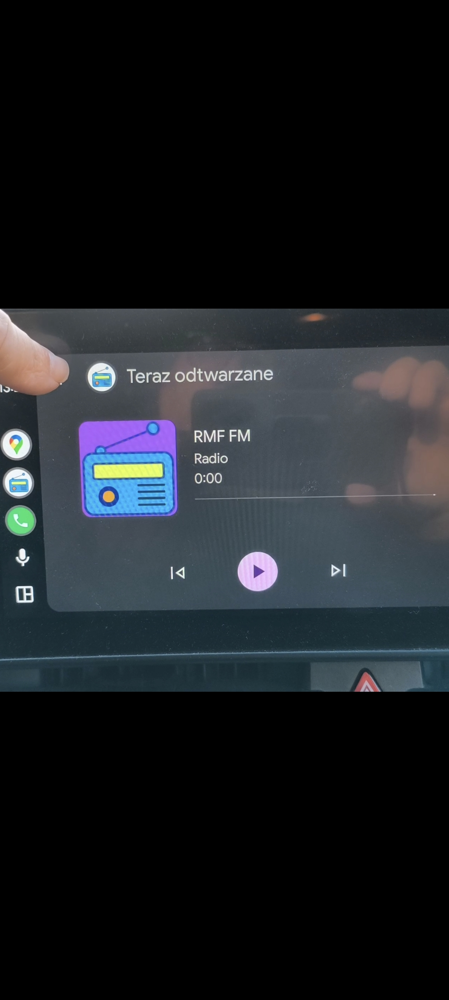
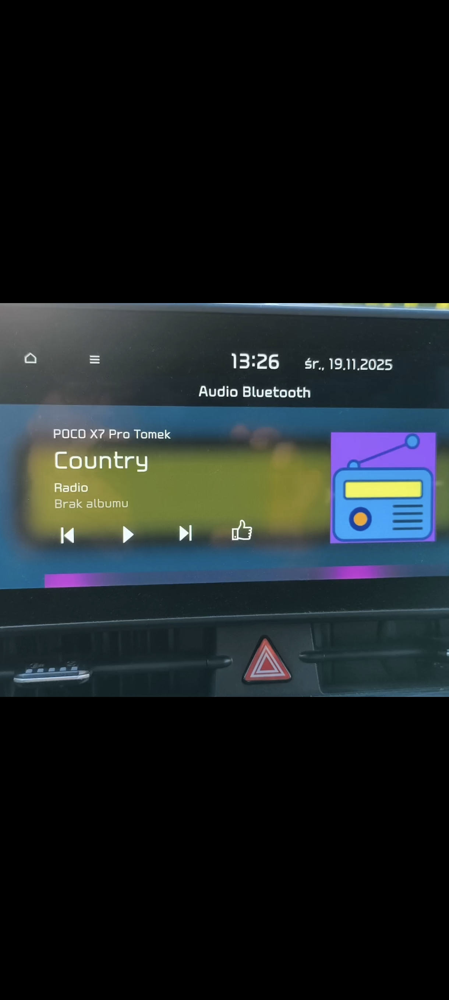
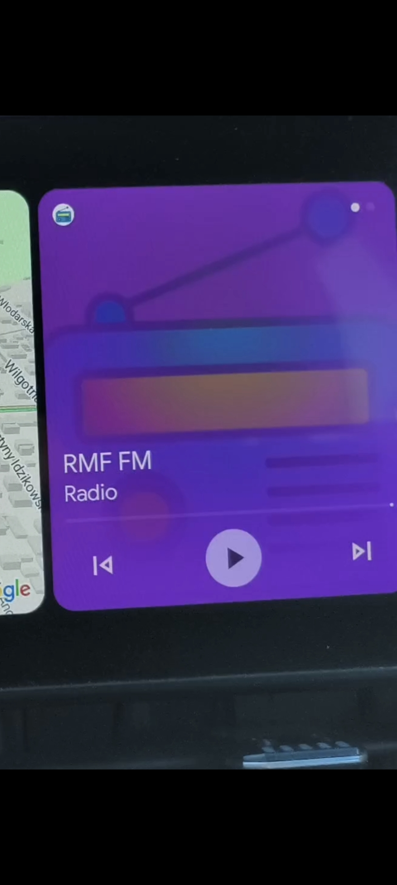
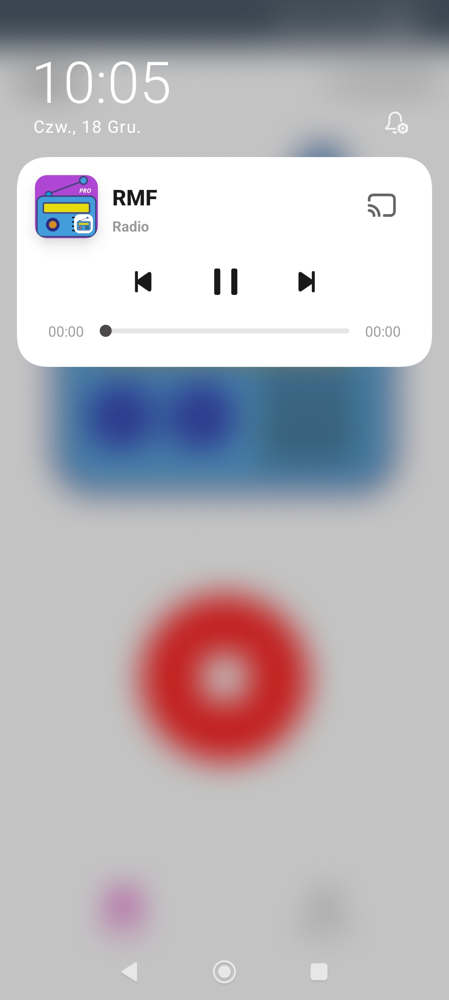

# 📻 RadioAndroidPRO v2.6

**Simple Internet Radio Application**

[](https://www.android.com/)
[](https://www.android.com/auto/)
[](LICENSE)
[](https://buycoffee.to/toevi)

## 🚗 The Best Alternative Radio App with Native Android Auto Integration

RadioAndroid PRO is a modern radio streaming application designed specifically for Android Auto with full integration support. Listen to thousands of radio stations worldwide while driving safely.

## ✨ Key Features

### 🎯 Core Features (FREE & PRO)
- **🚗 Full Android Auto Integration** - Not just audio streaming, complete native integration
- **🎵 Background Playback** - Music continues even when using other apps
- **🌍 Global Radio Stations** - Thousands of stations from around the world
- **📱 Bluetooth Ready** - Works via Android Auto and classic Bluetooth
- **🔗 Custom Stations** - Add your own HTTP/HTTPS streams
- **📻 fmstream.org Integration** - Browse and add stations easily

### ⭐ PRO Features
- **🎚️ 9-Band Professional Equalizer** (60Hz - 14kHz)
- **💾 JSON Import/Export** - Modern playlist management
- **📂 Advanced Playlist Management** - Easy backups and sharing
- **🎨 Enhanced UI** - Premium user interface
- **☕ Support Development** - Help maintain and improve the app

## 📥 Download

### 🆓 FREE Version
Available on Google Play Store
- Ready to use out of the box
- No configuration needed
- Full Android Auto support

[📱 Download from Google Play lite version](https://play.google.com/store/apps/details?id=com.tmfgroup.radioandroid)

### ⭐ PRO Version
Available on GitHub Releases
- Requires Android Auto developer mode
- Additional PRO features
- Support the developer

[📦 Download PRO APK](https://github.com/toevi/RadioAndroidPro/releases/download/RadioAndroidPro/com.tmfgroup.radioandroid-Signed.apk)

## 🔧 Installation

### FREE Version (Google Play)
1. Install from Google Play Store
2. Connect to Android Auto
3. Start listening! 🎵

### PRO Version (GitHub)
PRO version requires enabling Android Auto developer mode:

1. Open **Android Auto** app on your phone
2. Go to **Settings ⚙️** → scroll to **"Version"**
3. **Tap 10 times** on the version number
4. Message *"You are a developer"* will appear ✅
5. Tap **⋮** (menu) → **Developer settings**
6. Tap **⋮** (menu) → **developer mode**
7. Enable **"Unknown sources"** 🔓
8. Install the APK
9. Connect your phone to the car 🚗

## 📱 Screenshots

| Main Player | Stations List | Edit Station | Equalizer PRO | Android Auto | Car Bluetooth | Android Auto | Background Play | 
|-------------|---------------|--------------|---------------|--------------|---------------|--------------|-----------------|
|  |  |  |  |  |  |  |  |

## 💾 JSON Playlist Management (PRO)

PRO version uses modern JSON format for easy playlist management:

### Features
- **💾 Easy Backup** - Save an load entire stations list to one file
- **✏️ Manual Editing** - Edit playlists in any text editor
- **🤝 Easy Sharing** - Share stations with friends

### Example JSON Format

```json
[{"Nazwa":"RMF","Sciezka":"http://rs201-krk.rmfstream.pl/rmf_fm"},{"Nazwa":"RAM","Sciezka":"http://stream.prw.pl:8000/rammp3"}]
```

### How to Use
1. Copy the template above
2. Add your favorite stations
3. Adjust equalizer settings
4. Import the file into the app

## 🆚 Comparison with Alternatives

| Feature | Alternative Radio | Radio Player FREE | Radio Player PRO |
|---------|------------------|-------------------|------------------|
| **Android Auto Integration** | ⚠️ Basic | ✅ Full | ✅ Full |
| **Background Playback** | ✅ | ✅ | ✅ |
| **Equalizer** | ❌ | ❌ | ✅ 9-band professional |
| **Playlist Export** | ⚠️ PLS (legacy) | ❌ | ✅ JSON (modern) |
| **Manual Editing** | ❌ Difficult | ⚠️ Basic | ✅ Easy (JSON) |
| **UI/UX** | 😕 Complicated | 😊 Simple | 😎 Simple + Enhanced |
| **Bluetooth Support** | ✅ | ✅ | ✅ |

## 🛠️ Technical Details

- **Platform:** Android
- **Min SDK:** 35
- **Target SDK:** 36
- **Android Auto:** Full native integration
- **Audio Formats:** HTTP/HTTPS streaming
- **Equalizer:** 9-band (60Hz, 140Hz, 230Hz, 400Hz, 910Hz, 1kHz, 3.6kHz, 8kHz, 14kHz)

## 🔗 Useful Links
- **📻 Privacy Policy page:** (https://toevi.github.io/Android-Radio-privacy-policy/)
- **📻 Radio Stream Browser:** [fmstream.org](https://fmstream.org)
- **☕ Support Developer:** [Buy me a coffee](https://buycoffee.to/toevi)
- **✉️ Contact:** tomek.maselko@gmail.com

## 👍 Support the Project

If RadioAndroid PRO helps you in your daily travels, consider supporting the developer!

[](https://buycoffee.to/toevi)

Your support motivates further development! 🚀

## 📝 License

# Custom Software License

**Copyright © 2025 Tomek Maslowski**  
**All Rights Reserved**

## Terms and Conditions 
This license applies to the compiled Android application (APK file) only

Permission is hereby granted, free of charge, to any person obtaining a copy of this software and associated documentation files (the "Software"),
to use the Software for **personal, non-commercial purposes only**, subject to the following conditions:

### Permitted Uses:
- ✅ Personal installation and use
- ✅ Testing and evaluation


### Prohibited Actions:
- ❌ **Commercial use** - The Software may not be sold, rented, leased, or used for profit
- ❌ **Redistribution** - The software may not be copied, distributed or made available to third parties outside of the official website
- ❌ **Modification** - The Software may not be altered, modified, or merged with other software
- ❌ **Reverse Engineering** - Decompilation, disassembly, or reverse engineering of the APK is prohibited except where expressly permitted by applicable law.
- ❌ **Derivative Works** - Creating derivative works based on this Software is not permitted

### Required Attribution:
The above copyright notice and this permission notice shall be included in all copies or substantial portions of the Software.

### Disclaimer:
THE SOFTWARE IS PROVIDED "AS IS," WITHOUT WARRANTY OF ANY KIND, EXPRESS OR IMPLIED, INCLUDING BUT NOT LIMITED TO THE WARRANTIES OF MERCHANTABILITY, 
FITNESS FOR A PARTICULAR PURPOSE, AND NON-INFRINGEMENT. IN NO EVENT SHALL THE AUTHORS OR COPYRIGHT HOLDERS BE LIABLE FOR ANY CLAIM, DAMAGES, 
OR OTHER LIABILITY, WHETHER IN AN ACTION OF CONTRACT, TORT, OR OTHERWISE, ARISING FROM, OUT OF, OR IN CONNECTION WITH THE SOFTWARE OR THE USE OR OTHER DEALINGS IN THE SOFTWARE.

---

**For commercial licensing inquiries, please contact: [tomek.maselko@gmail.com]**

## 🤝 Contributing

Contributions are welcome! Please feel free to submit a Pull Request.

## ⭐ Star History

If you find this project useful, please consider giving it a star! ⭐

---

**Made with ❤️ for Android Auto enthusiasts**

© 2025 Tomek Maslowski
